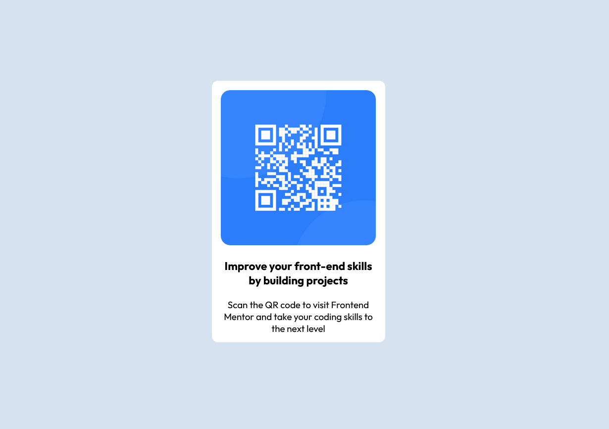

# Frontend Mentor - QR code component solution
 

## Table of contents

- [Overview](#overview)
  - [Screenshot](#screenshot)
  - [Links](#links)
- [My process](#my-process)
  - [Built with](#built-with)
  - [What I learned](#what-i-learned)
  - [Useful resources](#useful-resources)
- [Author](#author)


## Overview

### Screenshot




### Links

- Solution URL: (https://bshy201.github.io/QR-Code-Project/)

## My process

### Built with

- Semantic HTML5 markup
- CSS custom properties


### What I learned

Code I use to center the div:


```css
.container {
  position: absolute;
    top: 20%;
    left: 0;
    right: 0;
    bottom: 20%;
    margin: auto;
}
```


### Useful resources

- (https://www.freecodecamp.org/news/how-to-center-a-div-with-css-10-different-ways/) - This article helped me understand how to center a div element in a varity of ways


## Author

- Frontend Mentor - (https://www.frontendmentor.io/profile/Bshy201)


